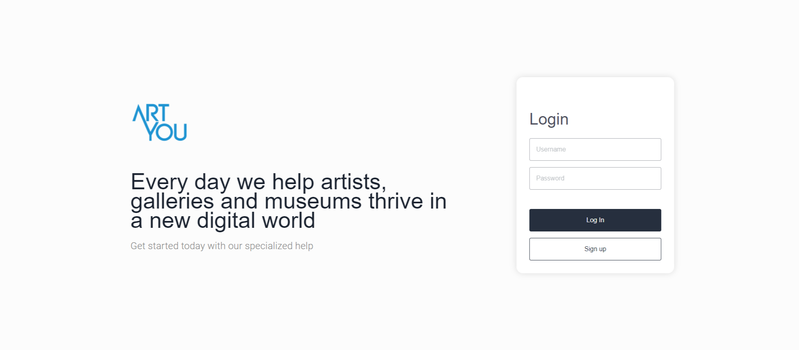
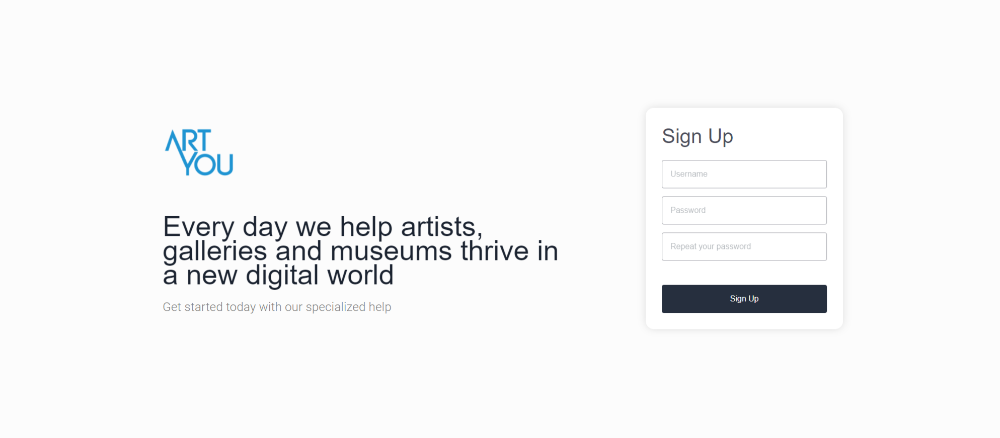

<h1 align="center">
One Blue Challenge
</h1>

A project that started with a challenge from the company One Blue was to create a front-end that would integrate with a proposed back-end. I decided to make a page with two routes a Log-in and Sign-Up.

 
 

## Technologies

This project is developed with the following technologies:

- React
- Yup
- Bootstrap

## Social Media

If you want to ask something, please contact me on my social media.

* **Instagram** - [@ronaldoarruda10](https://www.instagram.com/ronaldoarruda10/)
* **Linkedin** -  [nronaldo7](https://www.linkedin.com/in/nronaldo7/)
* **GitHub** - [ronaldoarruda](https://github.com/ronaldoarruda)

Made by Ronaldo Arruda